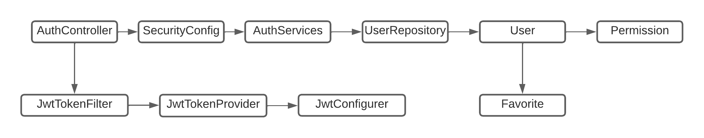

<h1>API Challenge NextIdea - Sprint 3 - Enterprise Application Development</h1>

<h2>ATENÇÂO!</h2>

Antes de iniciar os testes, é importante ressaltar 3 pontos:

<ul>
    <li>1. O Banco de Dados que a aplicação estava utilizando estava na nuvem, na plataforma da azure, por isso, agora é necessário configurar uma conexão com o banco de dados localmente. </li>
    <li>3. Esta aplicação também conta com a implementação do Swagger, ferramenta usada para documentação e para teste de API's.</li>
</ul>

<h2>Integrantes</h2>
<ul>
    <li>Nome: Higor Alves Santos | RM: 93359</li>
    <li>Nome: Karina Conceição Machado da Costa | RM: 96164</li>
    <li>Nome: Lucas Marques de Souza | RM: 95418</li>
</ul>

<h2>Objetivo</h2>

O objetivo da aplicação é utilizar o chatGPT para 
aprimorar a expêriencia do usuário na busca e descoberta 
de produtos. O chatGPT irá funcionar como um 
assistente pessoal de compras que irá abstrair os termos 
complexos dos produtos tornando-os de fácil compreensão para
usuários leigos.

<h2>Principais Funcionalidades</h2>
<table>
    <tr>
        <td>Componente</td>
        <td>Descrição</td>
    </tr>
    <tr>
        <td>Login</td>
        <td>O usuário é capaz de realizar login informando suas credenciais, username e password.</td>
    </tr>
    <tr>
        <td>Cadastro de Novo Usuário</td>
        <td>O usuário é capaz de realizar o cadastro informando os campos necessários. name, email e password.</td>
    </tr>
    <tr>
        <td>Desativa usuário</td>
        <td>O usuário é capaz de desativar o sua conta.</td>
    </tr>
    <tr>
        <td>Adiciona favorito</td>
        <td>O usuário é capaz de adicionar um favorito vinculado a sua conta.</td>
    </tr>
    <tr>
        <td>Deleta favorito</td>
        <td>O usuário é capaz de deletar um favorito vinculado a sua conta.</td>
    </tr>
    <tr>
        <td>Listar favoritos</td>
        <td>O usuário é capaz de listar todos os favoritos vinculados a sua conta.</td>
    </tr>
</table>

<h2>Escopo</h2>

Para tornar está solução realidade, o projeto irá utilizar

<ul>
    <li>Uma API back-end escrita em Java, resposável pela autenticação e operações do 
        usuário, tais como: login, cadastro, desativar conta,
        adicionar favorito, editar favorito e remover favorito
    </li>
    <li>Um banco de dados relacional, OracleSQL/MySQL, para armazenar
        os dados de persistêcia do usuário, tais como conta e favoritos.
    </li>
    <li>Uma interface front-end que irá consumir a API e ao mesmo 
        tempo consumir a API do chatGPT para realizar as pesquisas.
        Este front-end será um aplicativo mobile construido em 
        react-native e contará com a funcionalidade de STT (Speech-to-Text)
        e TTS (Text-to-Speech).
    </li>
</ul>

<h2>Arquitetura da Solução</h2>

<table>
    <tr>
        <td>Componente</td>
        <td>Descrição</td>
    </tr>
    <tr>
        <td>AuthController</td>
        <td>Expõe os endpoints correspondente a cada serviço contido no AuthServices. Se comunica com AuthServices.</td>
    </tr>
    <tr>
        <td>SecurityConfig</td>
        <td>Responsável pelas configurações de segurança, toda requisição que o AuthController recebe, passa por este arquivo de configuração.</td>
    </tr>
    <tr>
        <td>AuthServices</td>
        <td>Faz as operações do usuário incluindo a autenticação. Se comunica com UserRepository e com AuthController.</td>
    </tr>
    <tr>
        <td>UserRepository</td>
        <td>Faz as operações do usuário no banco de dados. Se comunica com AuthServices.</td>
    </tr>
    <tr>
        <td>User</td>
        <td>Representa a tabela de Usuários do banco de dados. Se comunica com Permission numa relação de muitos pra muitos e com também se comunica com Favorite em uma relação de um para muitos.</td>
    </tr>
    <tr>
        <td>Permission</td>
        <td>Representa a tabela de Permissões do banco de dados.</td>
    </tr>
    <tr>
        <td>Favorite</td>
        <td>Representa a tabela de Favorito do banco de dados.</td>
    </tr>
    <tr>
        <td>JwtTokenFilter</td>
        <td>Resposável por filtrar e validar se o token é valido. Se comunica com o JwtTokenProvider.</td>
    </tr>
    <tr>
        <td>JwtTokenProvider</td>
        <td>Faz as operações do JWT token, como validar token e gerar token.</td>
    </tr>
    <tr>
        <td>JwtConfigurer</td>
        <td>Faz as configurações do JWT. Se comunica com o JwtTokenProvider,</td>
    </tr>
</table>

<h2>Arquitetura da Solução - Macro</h2>

<h3>Tecnologias</h3>

Tecnologias usadas tanto no front-end como no back-end

<ul>
    <li>Java | Spring Framework</li>
    <li>React Native</li>
    <li>Expo</li>
    <li>Google Cloud Plataform | Google Speech to Text API</li>
    <li>Azure MySQL</li>
    <li>API ChatGPT</li>
</ul>

<h2>Endpoints</h2>
<table>
    <tr>
        <td>method</td>
        <td>path</td>
        <td>body</td>
        <td>status codes</td>
    </tr>
    <tr>
        <td>POST</td>
        <td>/auth/signin</td>
        <td>
            <code>
            { 
                "username":string, 
                "password":string 
            }
            </code>
        </td>
        <td>200, 400, 403, 500</td>
    </tr>
    <tr>
        <td>POST</td>
        <td>/auth/signup</td>
        <td>
            <code>
            {  
              "name": "string",  
              "email": "string",  
              "password": "string"  
            }
            </code>
        </td>
        <td>200, 400, 401, 403, 500</td>
    </tr>
    <tr>
        <td>DELETE</td>
        <td>/auth/delete</td>
        <td>
            <code>
            { 
                "username": "string",  
                "password": "string"
            }
            </code>
        </td>
        <td>200, 400, 401, 403, 404, 500</td>
    </tr>
    <tr>
        <td>GET</td>
        <td>/favorite</td>
        <td>
        </td>
        <td>200, 400, 401, 403, 404, 500</td>
    </tr>
    <tr>
        <td>POST</td>
        <td>/favorite</td>
        <td>
            <code>
            {  
                "idUser": "numeric",  
                "name": "string",  
                "url": "string"  
            }
            </code>
        </td>
        <td>200, 400, 401, 403, 404, 500</td>
    </tr>
    <tr>
        <td>DELETE</td>
        <td>/favorite</td>
        <td>
            <code>
            {  
                "idUser": "numeric",  
                "idFavorite": "numeric",  
            }
            </code>
        </td>
        <td>200, 400, 401, 403, 404, 500</td>
    </tr>
</table>

<h1>Passo a Passo – Processo de CI/CD<h1/>
    

Para criação da pipeline de Build do projeto, acesse o portal do Azure Devops e a aba pipelines. Feito isso, clique em “New pipeline” para criar uma nova pipeline.

 
Essa criação será feita através do modo clássico, então clique em “Use the classic editor” para seguir com a criação da pipeline.
 

Agora será necessário selecionar o software de versionamento no qual se encontra o projeto, no caso deste projeto é o Github. Logo, seleciona essa opção e informa o repositório para o qual iremos criar a pipeline e a branch Default para builds manuais e por trigger. Clique em “continue”.

 

Considerando que nossa aplicação se trata de uma API Java, iremos utilizar o maven para baixar as dependências do projeto. Por isso, procure por Maven e clique no botão “Apply”.

 

Nesta etapa de configuração da Pipeline, selecione a Agent pool que seja e a Agent Specification, no qual a aplicação irá rodar. Nos parâmetros seleciona o arquivo pom do repositório.

 

Em seguida, na configuração de “Get sources”, mantenha as informações dessa forma, selecionando o software no qual se encontra o repositório da aplicação, especificando a mesma e a branch Default.
>
 

Na configuração do Agent job 1, seleciona a mesma Agent pool e Specification escolhidas anteriormente.

Na mesma etapa, selecione novamente o arquivo pom.xml do projeto.

Ainda na configuração do Maven, um ponto bastante importante para essa etapa é a versão do Java que iremos utilizar para fazer a Build do projeto, pois a versão selecionada deve ser compatível com a usada na aplicação, caso contrário será apresentado um erro no download das dependências.

Em “Copy Files” deixe dessa forma, nessa etapa iremos copiar os arquivos que foram baixados na etapa anterior, isto é, a do Maven, na qual foram baixadas as dependências necessárias para rodar o projeto.

Para configuração da última “Task”, escolha um nome para o artefato que será gerado na Build e o nome que será mostrado durante a Build, no caso o “displayName”. Com relação ao path no qual o artefato será publicado, mantenha o mesmo apresentado abaixo.

Uma etapa importante para mantermos o processo de Continuous Integration e Continuous Delivery, vá na aba “Triggers” e selecione o check box “Enable continuous integration”. É necessário fazermos isso para que quando pegarmos o script yml da pipeline, ele informe que uma nova pipeline será iniciada no Azure Devops a cada novo commit para a branch especificada, nesse caso a main. Feito isso, salve e enfileire a aplicação.

Especifique a Agent pool e Specification com os mesmos valores de anteriormente, selecione a branch main e clique em “Run” para iniciar a pipeline de Build.

A nova pipeline será mostrada assim, clique no “Agent job 1” para ver as tasks com maior nível de detalhamento.

Os Steps serão apresentados dessa forma. Nesse caso, obtivemos uma build de sucesso.

É possível identificar, ao voltarmos para a página na qual vemos a pipeline que rodou, que o artefato da build foi gerado, pois há “1 published”, que informa a criação de um artefato.

Pipeline de Release

Agora iremos configurar a pipeline de release, para que possamos fazer o deploy da aplicação. Vá para a aba “Releases” do menu lateral e clique em “new” para criar uma nova pipeline de release.

Selecione um nome para o stage de release, clique no “X” após isso e clique em “+Add” para adicionar um artefato.

Na etapa de configuração do artefato informa o nome do projeto no qual se encontra, o projeto no qual foi rodado a pipeline que gerou o artefato que será usado para fazer o deploy e deixe o Default version com o valor abaixo.

Na aba Tasks, adicione o serviço abaixo para realizar o deploy do web  app. Na etapa de release, informe o nome do web app que foi criado na sua conta Azure e sua subscription.

Em Run on agent, seleciona novamente a Agent pool e Specification.

Ainda na mesma etapa de configuração, selecione o local no projeto no qual a pipeline de build gerou o artefato e especifique o caminho para esse artefato.

Na última etapa de configuração do serviço de deploy, informe os dados abaixo e mantenha o nome do mesmo web app informado anteriormente.

Especifique novamente o caminho para o artefato gerado na pipeline de Build e clique em “create release”.

Clique em create para criar a pipeline de release.

Ela será apresentada dessa forma como a pipeline “Release 2” na aba de releases, que está em andamento.

Ao clicar naquela pipeline da página anterior, essa será aberta, informando que a etapa de release está em andamento.

Ao clicar no stage de release, essa página com o detalhamento dos Steps rodados para o deplouy será apresentada.

Ao clicar no step de deploy, após a finalização do processo da pipeline, ele mostrará a URL na qual o serviço está rodando.

<h2>
Script yml
</h2>

Um ponto importante, é que escolhemos fazer a build do modo clássico, mas ainda é possível exportar essas configurações que fizemos e unir em um arquivo único de configuração de pipeline. Abaixo seguem os locais nos quais podemos pegar os scripts yaml:

Na pipeline de release, podemos pegar o do serviço de deploy ao clicar nesse “View YAML”

E no de build, ao clicarmos nesses três pontos haverá a mesma opção para exportar o script de build.

Após o deploy, utilizamos aquele link no qual a aplicação está rodando e adicionamos a rota do Swagger, posto que nosso backend possui essa integração. Desta forma, podemos testar a aplicação rodando no web app.

